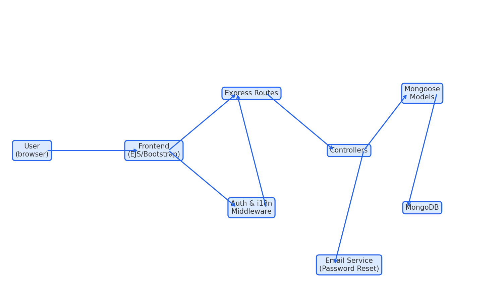
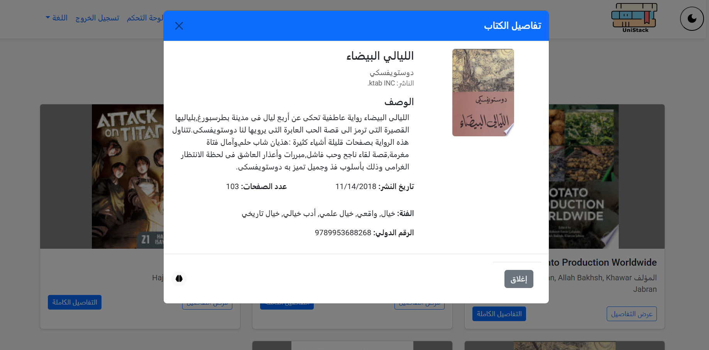

# 📚 UniStack (University Book Library Management System)

A bilingual (English / Arabic) web platform that lets university students **search, borrow, and review** library books online while giving librarians full control over the catalogue.

## Technologies

### Frontend


### Backend


### Tools


## Distinctive features

> - 🔍 Smart AI search assistant
> - 📚 Smart autofill book descriptions using google books API
> - 🌙 Dark / Light mode
> - 🌐 Full RTL/LTR & i18n support

---

## 🎯 Project Goals

1. Replace manual library workflows with a responsive self‑service portal.
2. Demonstrate clean MVC architecture, RESTful APIs, and secure auth.
3. Showcase best‑practice **ES6**, **translation**, and **theme** patterns.

---

## 🗺️ System Flow Chart

 <!-- Replace with your own image or link -->

---

## 📦 Repository Structure

```
.
├── backend
│   ├── src/
│   │   ├── controllers
│   │   ├── models
│   │   ├── routes
│   │   └── middleware
│   └── server.js
├── frontend
│   ├── public/   # CSS, JS, images
│   └── views/    # EJS templates
└── README.md
```

---

## 🚀 Getting Started (Local)

```bash
# 1) Clone & install
git clone https://github.com/NAWR9/book-library-management-system.git
cd book-library-management-system
npm install            # installs root tools (eslint / prettier)

# 2) Setup environment
cp .env.example .env   # fill in vars
npm install
npm run dev            # nodemon on http://localhost:5000

```

### .env example

```env
PORT=5000
MONGO_URI=mongodb://localhost:27017/library
JWT_SECRET=replace_me

# Email (password reset)
EMAIL_HOST=smtp.example.com
EMAIL_PORT=587
EMAIL_SECURE=false
EMAIL_USER=your@example.com
EMAIL_PASSWORD=app_password
EMAIL_FROM=noreply@library.com
EMAIL_FROM_NAME=University Library

# AI API KEY (smart search)
GROQ_API_KEY=API_KEY_HERE
```

---

## 🖥️ Screenshots

| Light Mode                                          | Dark Mode                                          |
| --------------------------------------------------- | -------------------------------------------------- |
|            |            |
| Admin Dashboard                                     | User Dashboard                                     |
|  |  |
| Borrow                                              | Book Details                                       |
|           |    |

---

## ✨ Current Features

- User / admin registration & JWT login
- Role‑based navbar
- Book CRUD (admin)
- Student borrow requests (pending/approved/returned)
- Password reset via email
- Responsive design with RTL flip
- Dark / Light theme toggle
- Full English / Arabic translation via i18next

---

## 🔮 Future Work

- **AI Search Assistant** – let users describe a story or ask for “a short sci‑fi novel about space exploration”; OpenAI will return keywords → MongoDB query → suggestions.
- **Gamification** – award points & badges for reading streaks, reviews, and on‑time returns.
- PWA offline support & push notifications

---

## 👥 Team

| Name                          | GitHub                                                 |
| ----------------------------- | ------------------------------------------------------ |
| Osamah Sadeq Shubaita         | [@NAWR9](https://github.com/NAWR9)                     |
| Mohammed Abdullah Alosaimi    | [@moabos](https://github.com/moabos)                   |
| Abdulrhman Abdulwasie Anwar   | [@Abdulrhmansaleh](https://github.com/Abdulrhmansaleh) |
| Abdulmajeed Abdullah Alsakran | [@absakran01](https://github.com/absakran01)           |
| Ahmed Abdullah Alzaid         | [@AhmedAlzaid](https://github.com/AhmedAlzaid)         |

---

## 📝 License

MIT

---

## 📚 Resources

- Imam University CS346 Web Development Course Materials
- i18next documentation
- MongoDB University Tutorials
